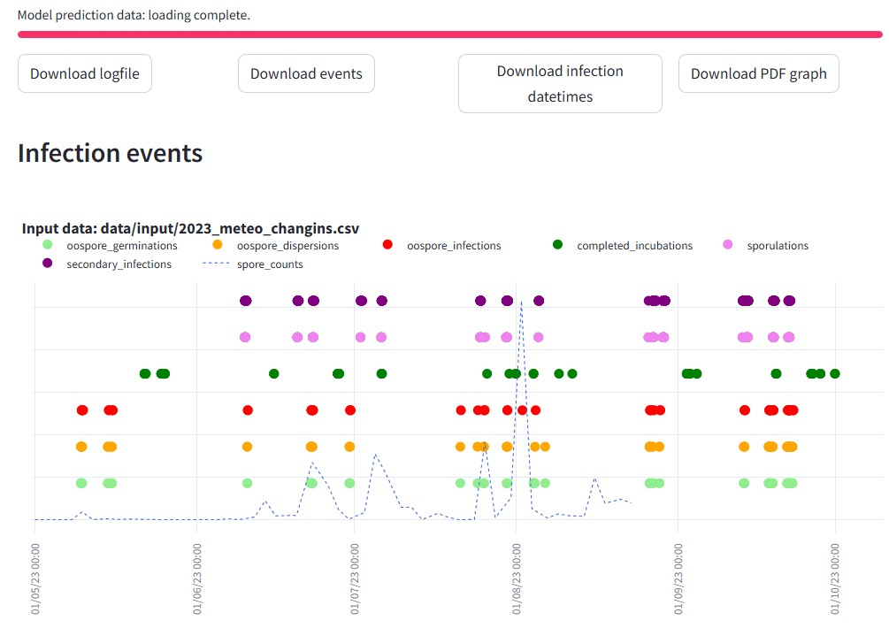

# Plasmopy v1.0

Infection prediction modeling of *Plasmopara viticola* life cycle stages in vineyards using weather data. This project represents a revisited and customizable Python version of the VitiMeteo-Plasmopara model in use at Agroscope (Switzerland) for downy mildew infection forecasting.



## Quick setup & run


### Setup with Bash console

1. Make sure to have Python3 in your Unix system. Install [Poetry](https://python-poetry.org/docs/#installation), a Python packaging and dependency manager:
```bash
curl -sSL https://install.python-poetry.org | python3 - --version 2.1.1
```
N.B. Do not forget to add poetry's path to your *.bashrc* file.

E.g. on Linux machines, modify the ".bashrc" file for permanent inclusion to path, by adding the following line at the end:
export PATH="home/YOUR_USERNAME/.local/bin/poetry:$PATH"

2. Make sure to have Git installed on your computer (https://github.com/git-guides/install-git), then clone *Plasmopy* with the following command in your terminal:

```bash
git clone https://github.com/agroscope-ch/plasmopy.git
```

3. Move into the *plasmopy* folder where the Makefile is located (replace *user_path_to_plasmopy* with your folder path):

```bash
cd user_path_to_plasmopy/plasmopy
```

4. Install all dependencies and activate the virtual environment for this project:
```bash
make setup
```

N.B. To separately install the required packages and activate the virtual environment, the respective specific commands are:
```bash
make install
```
and
```bash
make activate
```

### Data processing, model configuration and run from terminal

1. Load your raw timeseries input data in the folder `data/input/`

2. Choose your data processing and model parameters configurations by customizing the `main.yaml` config file in the `config/` folder.

3. Run the infection prediction model with the command:
```bash
make run
```

### Data processing, model configuration and run from the streamlit web-app

Launch the web-app from your browser with the command:
```bash
make app
```


## Developer Tools

### Tools used in this project
* [Poetry](https://towardsdatascience.com/how-to-effortlessly-publish-your-python-package-to-pypi-using-poetry-44b305362f9f): Dependency management - [article](https://mathdatasimplified.com/2023/06/12/poetry-a-better-way-to-manage-python-dependencies/)
* [hydra](https://hydra.cc/): Manage configuration files - [article](https://mathdatasimplified.com/2023/05/25/stop-hard-coding-in-a-data-science-project-use-configuration-files-instead/)
* [pre-commit plugins](https://pre-commit.com/): Automate code reviewing formatting
* [DVC](https://dvc.org/): Data version control - [article](https://mathdatasimplified.com/2023/02/20/introduction-to-dvc-data-version-control-tool-for-machine-learning-projects-2/)
* [pdoc](https://github.com/pdoc3/pdoc): Automatically create an API documentation for your project

### Project Structure
```bash
.
├── config                      
│   └── main.yaml                   # Main configuration file
├── data            
│   ├── input                       # input data
│   ├── output                      # output from model run, including logs and graphs
│   ├── tmp                         # temporary processing data needed for running
│   ├── raw                         # raw data
│   └── raw.dvc                     # DVC file of data/raw
├── docs                            # documentation for your project
├── .gitignore                      # ignore files that cannot commit to Git
├── Makefile                        # store useful commands to set up the environment and run the model
├── models                          # store models
├── notebooks                       # store notebooks
├── .pre-commit-config.yaml         # configurations for pre-commit
├── pyproject.toml                  # dependencies for poetry
├── README.md                       # describe your project
├── src                             # store source code
│   ├── __init__.py                 # make src a Python module 
│   ├── main.py                     # orchestrates the execution of the scripts
│   ├── load_data.py                # functions for loading raw data
│   ├── process_data.py             # functions for formatting and processing weather raw data
│   ├── infection_model.py          # launches the specific modeling algorithm at each infection stage
│   └── infection_functions         # store the algorithms for each infection stage
└── tests                           # store tests
    ├── __init__.py                 # make tests a Python module 
    ├── test_process.py             # test functions for process_data.py
    └── test_model.py               # test functions for infection_model.py
```


### Recreate the project folder template

This project development guide is inspired from [Khuyen Tran’s blog](https://towardsdatascience.com/how-to-structure-a-data-science-project-for-readability-and-transparency-360c6716800).


1.	Install cookiecutter (allows for a structured / organized creation of a new python project https://github.com/cookiecutter/cookiecutter) via pip:
```bash
pip install cookiecutter
```

2.	Add local installation binaries to $PATH temporarily on the Bash console (replace #### with your user folder):
```bash
export PATH="/home/###/.local/bin:$PATH"
```

Or permanently by adding the same command line at the end of the `.bashrc` file in the users’s home folder.

If the change was made in a permanent fashion, make sure to apply the changes by sourcing again the .bashrc file, by first moving to your personal home folder:
```bash
cd ~
```

And reloading the .bashrc profile:
```bash
source .bashrc
```

3.	We can now call the cookiecutter software and download a default project template to start our project specifications:
```bash
cookiecutter https://github.com/khuyentran1401/data-science-template --checkout dvc-poetry
```

This command will start a prompt asking for the project folder name, the author’s name, and the compatible python version. At the time of writing, the Python version installed in RStudio Server “Agsad” is Python 3.10.12.


### Virtual environment *plasmopy*

Creating a Python project environment for the Plasmopy model implementation in Python (vitimeteo-plasmopara-py).


1.	Install poetry for optimized package version management:
```bash
curl -sSL https://install.python-poetry.org | python3 - --version 2.1.1
```

2.	Download dependencies and create the project’s specific virtual environment with the following command line code launched from within the project’s home folder:
```bash
poetry install
```

To add a new library, run:
```bash
poetry add <library-name>
```

To remove an existing library, run:
```bash
poetry remove <library-name>
```


### Initialize a git repository

```bash
git init
```


## Check code before committing

This template uses the following hooks, called in the hidden file `.pre-commit-config.yaml`:

- Ruff: An extremely fast Python linter, written in Rust. It supports 500 lint rules, many of which are inspired by popular tools like Flake8, isort, pyupgrade, and others.
- black is a code formatter in Python.
- interrogate: Checks your code base for missing docstrings.

To add pre-commit to git hooks, type:

```bash
pre-commit install
```

Now, whenever you run git commit, your code will be automatically checked and reformatted before being committed.


### Version your data

To track changes to the `data` directory, type:

```bash
dvc add data
```

This command will create the `data.dvc` file, which contains a unique identifier and the location of the `data` directory in the file system.

To keep track of the data associated with a particular version, commit the `data.dvc` file to Git:
```bash
git add data.dvc
git commit -m "add data"
```

To push the data to remote storage, type:
```bash
dvc push 
```

### Auto-generate API documentation

To auto-generate API document for your project, run:

```bash
make docs
```
